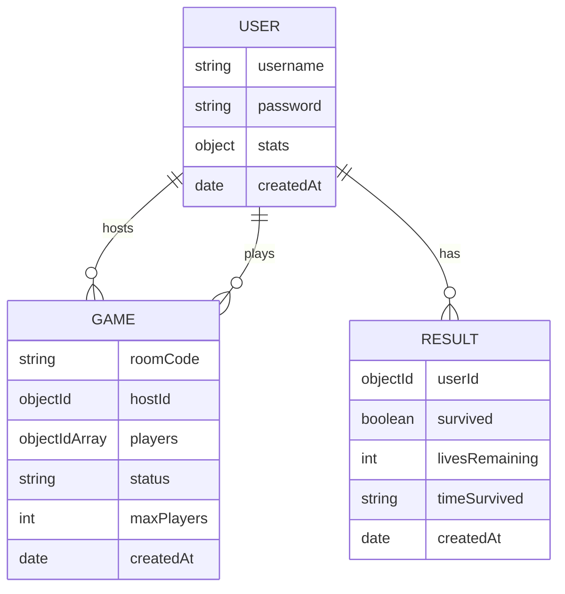
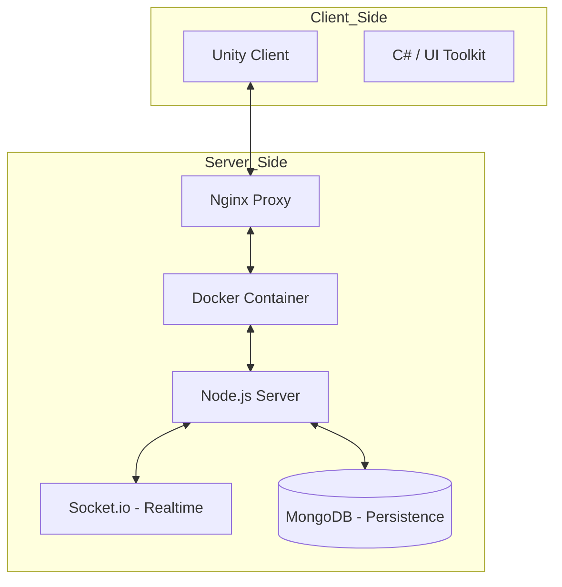

# Documentació Tècnica: Five Night's at Pedralbes

## 1. Diagrama Entitat-Relació (E/R)
Aquest diagrama mostra l'estructura de dades a la base de dades MongoDB i com es relacionen les col·leccions:

## 2. Diagrama d'Arquitectura
Descripció de la infraestructura i el flux de comunicació entre els diversos components del sistema:

